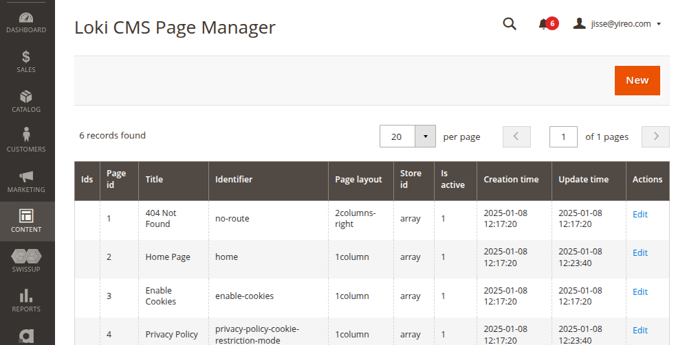

# YireoTraining_ExampleLokiAdminCmsPage

**This Magento 2 module demos the usage of [Yireo_LokiAdminComponents](https://github.com/yireo/Yireo_LokiAdminComponents) to code a grid with ease.**

### Installation
```bash
composer require yireo-training/magento2-example-loki-admin-cms-page@dev
bin/magento module:enable YireoTraining_ExampleLokiAdminCmsPage
```
### Usage
Navigate via the menu **Content > Pages (Loki)**.

Note that this example module is not about the usage, it is about the code. See how little code was involved to create this grid.


